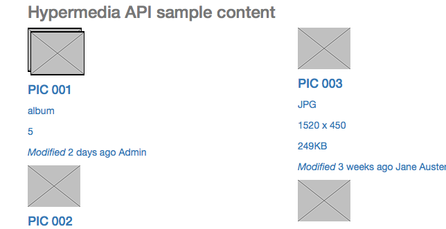
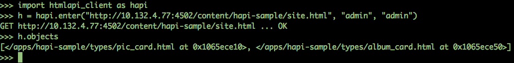
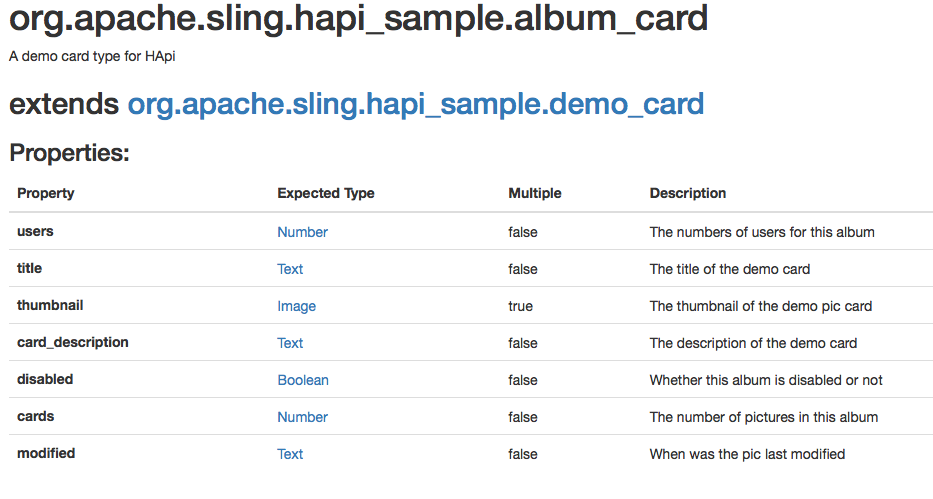
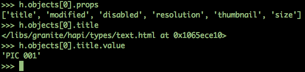
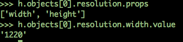
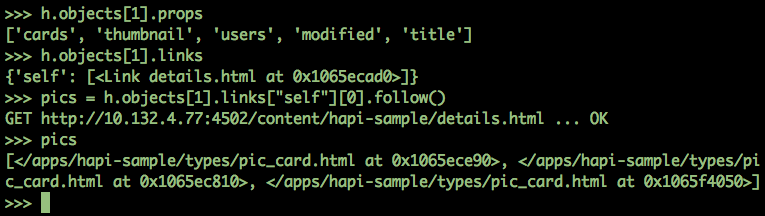

# <a name="section-1">HApi - Hypermedia API tools</a>

The hypermedia API tools are a way to enable sling component developers to add metadata information to their HTML components and easily define an API using the html markup generated by the components. 

HApi tools work with [sightly](http://docs.adobe.com/docs/en/aem/6-0/develop/sightly.html), JSP or any scripting language that can call java code. For understanding how microdata works, read the next section, [Hypermedia API with Microdata](#section-2).

To see how the HApi implemetation works, read [How HApi works, by example](#section-3)

# <a name="section-install">Installation</a>
  The two bundles, core and samplecontent need sightly installed on the sling instance.

  You can then install both with _mvn clean install sling:install_

  After that, to check the sample page go to http://localhost:8080/apps/sling/hapi_sample/site/site.html and check out the sample page.

  See below for consuming the API with a generic client.


# <a name="section-2">Hypermedia API with Microdata</a>
There is a lot of confusion surrounding this term, but shortly put, it's an API having content with links. We can use it a way of defining a protocol-agnostic API for our resources, designing it from the client-side, using the html markup as the media type. This means the requested resource representation would be displayed in browsers out-of-the-box, but also understood by any user or automaton which understands the API. Such APIs can be defined for XML, HTML, JSON and becomes a hypermedia API by adding links to the content. One way of defining an API over html is using the [microdata specification](http://schema.org/docs/gs.html) (reading the examples provides a lot of insight). The links are already semantically defined in HTML, so that fullfills the requirements for a hypermedia API.

For us out there in a hurry, let's take the following short example from the [schema.org](http://schema.org/docs/gs.html) page:

```html
    <div itemscope itemtype="http://schema.org/Movie">
       <h1 itemprop="name">Avatar</h1>
       <span itemprop="genre">Science fiction</span>
       <a href="../movies/avatar-theatrical-trailer.html" itemprop="trailer">Trailer</a>

       <div itemprop="director" itemscope itemtype="http://schema.org/Person"> 
           Director: <span itemprop="name">James Cameron</span> (born <span itemprop="birthDate">August16, 1954)</span>
       </div>
    </div>
```

The attribute _itemscope_ defines a scope for an object. The (optional) _itemtype_ links to a description of the type of the object. Inside an element with an _itemscope_ attribute, we have descendant elements with a property _itemprop_. This means the _name_  property will point to the enclosed object, which is the simple text "Avatar". Similarly, the _genre_ property is "Science Fiction". 

The _director_ property is not a simple type, so it defines a new _itemscope_. Also, the _itemtype_ shows it's a Person. Now, the schema for Person defines the _name_ and the _birthDate_ properties, which are pointed to the same way as above.

# <a name="section-3">How HApi works, by example</a>

In order to see how HApi works, the best way is to check an example. In the sample content module, we have a demo app that defines an API and uses that in the sightly components. The best way to start is to analyze the end result and acknowledge it's usefuleness:

## <a name="section-3a">Consuming the API</a>

The app looks like this in the browser:


The generated content looks something like this for the first card:

```html
            <div itemtype="/apps/sling/hapi_sample/types/album_card.html" itemscope="itemscope" class="card-asset">
                <a href="details.html" rel="self">
                    

                    <div>
                        <h4 itemprop="title" itemtype="/libs/sling/hapi/types/text.html">PIC 001</h4>

                        <p class="type">album</p>

                        <p itemprop="cards" itemtype="/libs/sling/hapi/types/number.html" class="size">5</p>
                        <meta itemprop="disabled" itemtype="/libs/sling/hapi/types/boolean.html" content="false">
                        <div class="myinfo">
                            <p class="mymodified">
                                <i>Modified</i>
                                <span itemprop="modified" itemtype="/libs/sling/hapi/types/text.html" class="date">2 days ago</span>
                                <span>Admin</span>
                            </p>
                        </div>
                    </div>
                </a>
            </div>
```

The entities that have semantic meaning to us (e.g. Are part of the API) are the elements annotated with microdata, links and forms: 
 * `<div itemtype="/apps/sling/hapi_sample/types/album_card.html" itemscope="itemscope" class="card-asset">`
 * `<a href="details.html" rel="self">`
 * `<link ...>`
 * `<form ... >`

 Because the API is defined using the generated HTML (same consumed by the browser), we can consume the _real_ content using any microdata thin, application-agnostic client.
 A simple example is using [a simple html python client](https://github.com/dulvac/htmlapi-client-python/blob/master/htmlapi_client.py), but any client can be used. Here's what it can do:
 


We can see that we have two objects in the page/ resource (because I've chosen to expose just two), one of type **pic_card** and one of type **album_card**. The types are URLs resolvable in sling. They look something like this in the browser:
 


Let's continue using the html client to consume our API:




For a hypermedia API, we use links as a way to change the state of the application, like it happens in the browser:



So navigating/ changing state works by using the semantic meaning of links in html. Except the enter() function, there is no http url needed to use the sling web application. If you define your links and link relations correctly, any microdata client like this can change the state, in addition to consuming the content defined through the microdata hypermedia API.

As you've probably noticed, we use some domain-specific types for _itemtype_. This is how you define the types:

## Defining the types

The types are defined as nt:unstructured nodes in the repository with a certain _sling:resourceType_ configurable in the OSGi config of the HApiUtil service:

```json
{

    "fqdn": "org.apache.sling.hapi_sample.album_card",
    "description": "A demo card type for HApi",
    "name": "album_card",
    "sling:resourceType": "sling/hapi/components/type",
    "parameters": [ ],
    "extends": "/apps/sling/hapi_sample/types/demo_card",
    "jcr:primaryType": "nt:unstructured",
    "thumbnail": 

{

    "description": "The thumbnail of the demo pic card",
    "type": "org.apache.sling.hapi.common.Image",
    "multiple": true,
    "jcr:primaryType": "nt:unstructured"

},
"disabled":
{

    "description": "Whether this album is disabled or not",
    "type": "org.apache.sling.hapi.common.Boolean",
    "multiple": false,
    "jcr:primaryType": "nt:unstructured"

},
"modified":
{

    "description": "When was the pic last modified",
    "type": "org.apache.sling.hapi.common.Text",
    "multiple": false,
    "jcr:primaryType": "nt:unstructured"

},
"cards":
{

    "description": "The number of pictures in this album",
    "type": "org.apache.sling.hapi.common.Number",
    "multiple": false,
    "jcr:primaryType": "nt:unstructured"

},
"users":

    {
        "description": "The numbers of users for this album",
        "type": "org.apache.sling.hapi.common.Number",
        "multiple": false,
        "jcr:primaryType": "nt:unstructured"
    }

}
```

## Using the sightly HApiUse class

After defining the types needed for the component in question, you can immediately benefit from the HApi tools and add the microdata annotations. There is also validation for the properties and the itemtype for properties is added automatically by the tools. 

This is how a sightly component using it looks like:

```html
<div data-sly-use.card="${'org.apache.sling.hapi.sightly.HApiUse' @type='/apps/sling/hapi_sample/types/pic_card'}"
                 data-sly-attribute="${card.itemtype}" class="card-asset">
                <a rel="self" href="details.html">
                    

                    <div>
                        <h4 data-sly-attribute="${card.itemprop['title']}">PIC 001</h4>

                        <p class="type">PSD</p>

                        <p data-sly-attribute="${card.itemprop.resolution}"
                           data-sly-use.resolution="${'org.apache.sling.hapi.sightly.HApiUse' @type=card.proptype.resolution}" class="resolution">
                            <span data-sly-attribute="${resolution.itemprop.width}">1620</span> x <span
                                data-sly-attribute="${resolution.itemprop.height}">670</span>
                        </p>

                        <p data-sly-attribute="${card.itemprop.size}" class="size">249KB</p>
                        <meta data-sly-attribute="${card.itemprop.disabled}" content="false"/>
                        <div class="myinfo">
                            <p class="mymodified">
                                <i>Modified</i>
                                <span data-sly-attribute="${card.itemprop.modified}" class="date">2 days ago</span>
                                <span>Admin</span>
                            </p>
                        </div>
                    </div>
                </a>
            </div>
```


The sightly script snippet above produces the html we saw in the section [Consuming the API](#section-3a).
You only need to parameterize the use object once with the type identifier and the tool can validate the properties and infer the property type and automatically add the required itemtype attribute. Were we to try the following attribute on the pic_card markup, we'd get a runtime exception:

```html
</span>           
```

```
org.apache.sling.hapi.HApiException: Property inexistent_property does not exist for type /apps/hapi-sample/types/pic_card
```
